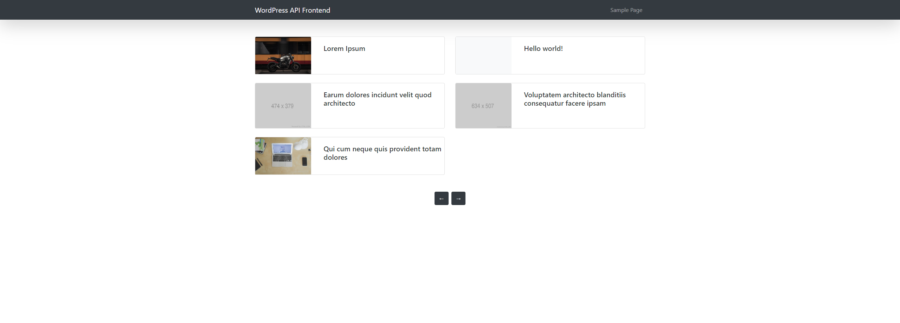
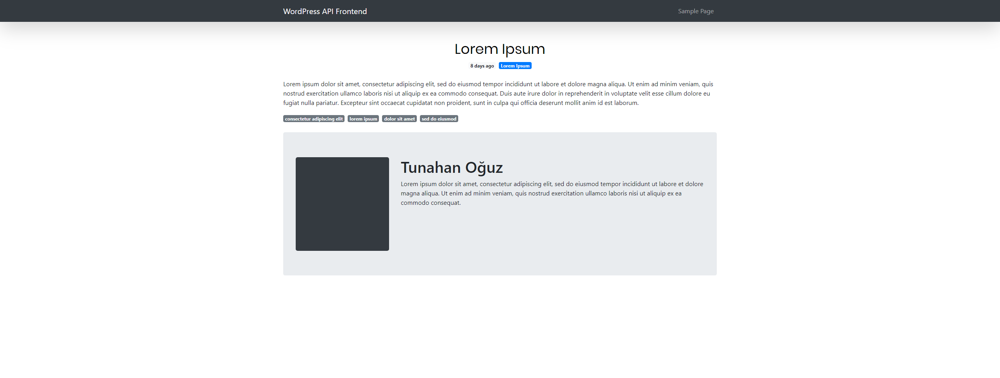

# A simple blog with React and WordPress API
I've created a blog as using React for frontend and WordPress API for backend. This is just a simple blog.

In this project, I've used an React SSR application that I had built for general usage earlier.

If you want to see my starter React SSR project, you can click [here](https://github.com/tunahanoguz/react-ssr).

## Usage
```
npm install
//
yarn install
```

```
// For development
npm run dev //or
yarn run dev

// To build
npm run build //or
yarn run build
```

## Demo (For just 2 pages)



